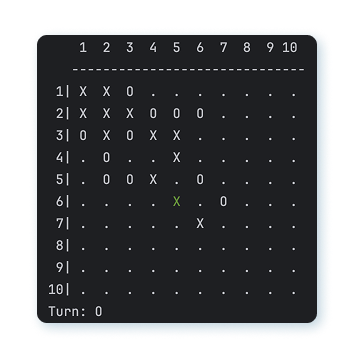

# Gomoku-AI

A console-based Gomoku game implemented in Java with a modular and extensible AI system.

## Features

- Minimax algorithm with alpha-beta pruning
- Heuristic board evaluation function
- Optimized move generation near active zones (radius-based)
- Flexible player system: Human vs AI, AI vs AI, or custom strategies

